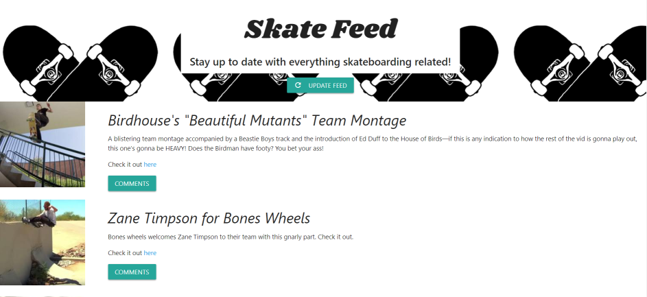

# Skate Feed

The purpose of this app is to present you with the latest skateboarding related articles, scraped from the world famous **Thrasher Magazine** website.

Check it out here: https://skate-news-2018.herokuapp.com

## Rundown

* When you visit the link above, you will be presented with the title of the app and an `UPDATE FEED` button.

* Upon selecting this button, you will now be presented with the latest scraped articles.
    * The articles are identified with a headline, brief description, a thumbnail and a link to the original post.

* Just below the aforementioned information will be a `COMMENTS` button. 
    * Each button is uniquely tied to its article by an ID.
    * Upon clicking this button, comments (if any) will trigger and populate a modal.
    * In this modal, you are able to **delete** any comment visible by selecting the ` X ` button to the right of each comment.
    * Also, you are able to **add** your own comment by filling out the **Add A Comment** input and then selecting the `+` button towards the bottom left of the modal.
    * Either the delete or add a comment functionality will exit the modal and return to the articles page. Re-select the `COMMENTS` button to see any changes you made.
 
* If wish to update the contents of **Skate Feed**, simply select the `UPDATE FEED` button once more and the content will be updated as long as there are new articles on the scraped website.

* You should also notice that there are no duplicate articles displayed. This is intentional. No one likes seeing *double*.

* Most importantly, you can comment with **emoji**. Don't believe me? Try it!

## Behind The Scenes

* All of the information displayed is actually being saved in a database. So if you were to come back to the site, you will see your comments are still there and you may also see comments from another user.

### Technologies/Tools Used In This App:
* Javascript, jQuery
* HTML5, CSS3
* Materialize.CSS
* Heroku
* MVC
* mLab (remote MongoDB database)
* Node.js + packages: 
    * express.js
    * express-handlebars.js
    * mongoose.js
    * cheerio.js
    * morgan (logger)
* Postman (Testing)
* Robo 3T (Testing)

### Challenges Faced:
* Working with handlebars, I faced a challenge looping through a unique article's comments. Only the ObjectID would show, but no text. I ended up using jQuery for this to work.
* The POST comment route would work, but upon clicking the `+` comment button, it would add a comment to the wrong article. This bug took me a while to figure out. The *data-id* value was correct, but without a refresh on the page, the button would retain the previous value. Got it fixed though!

### Future Development: 
* Definitely would like to polish up the design and customize it better.
* Implement one or two more websites to scrape articles from.
* Let the user choose a skateboarding site of their choice to scrape articles from.

Thanks for your time! Hope you enjoyed this project.